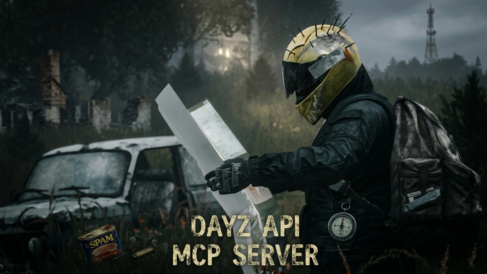

# enforce-mcp-dayz



MCP (Model Context Protocol) server for **DayZ Enforce Script**. Gives any AI coding assistant deep knowledge of the DayZ scripting API — semantic search across 5800+ vanilla classes, code validation, class hierarchy, reverse call graphs, and more.

## Features

| Tool | Description |
|---|---|
| `search_function` | Semantic / exact / fuzzy search across 25 000+ methods |
| `get_function_details` | Full signature, parameters, body, and related functions |
| `find_usage_examples` | Real usage examples from vanilla scripts |
| `get_class_hierarchy` | Inheritance tree and modded extensions |
| `find_callers` | Reverse call graph — who calls a given method |
| `validate_code` | Enforce Script Iron Rules checker (ternary, try/catch, casts, etc.) |
| `find_vanilla_alternative` | Suggests vanilla API for custom code |
| `parse_script` | Parse Enforce Script and extract AST |

## Quick Start

```bash
git clone https://github.com/quantumloader/dayz-api-mcp-server.git
cd dayz-api-mcp-server
npm install
npm run build
```

### Index vanilla scripts

Point to your DayZ Tools script dump (usually extracted via DayZ Tools):

```bash
# Index all layers (1_Core through 5_Mission)
node dist/indexer/index-cli.js index P:/scripts

# Or use the batch file
Index-All-Scripts.bat
```

Output: `data/index.json` (~30 MB, 5800+ classes, 25000+ methods, 300+ enums).

### Connect to your IDE

**Windsurf** — add to MCP settings:
```json
{
  "mcpServers": {
    "dayz-enforce": {
      "command": "node",
      "args": ["P:/enforce-mcp-dayz/dist/server/index.js"]
    }
  }
}
```

**Claude Desktop** — add to `claude_desktop_config.json`:
```json
{
  "mcpServers": {
    "dayz-enforce": {
      "command": "node",
      "args": ["P:/enforce-mcp-dayz/dist/server/index.js"]
    }
  }
}
```

Replace `P:/enforce-mcp-dayz` with your actual path.

## Project Structure

```
src/
├── parser/
│   ├── token.ts              # Token types
│   ├── rules.ts              # Keywords, operators
│   ├── lexer.ts              # Tokenizer with #ifdef/#endif support
│   └── EnforceScriptParser.ts # Token-based parser → ParsedClass/Method/Enum
├── indexer/
│   ├── Indexer.ts             # Index interface
│   ├── FileSystemIndex.ts     # TF-IDF index, reverse call graph, search
│   └── index-cli.ts           # CLI: index / search / verify
├── validator/
│   └── CodeValidator.ts       # Iron Rules validation engine
├── server/
│   ├── DayZMCP.ts             # MCP server with all tools
│   └── index.ts               # Entry point
└── types/
    └── index.ts               # Shared TypeScript types
```

## Tools Reference

### search_function

```json
{ "query": "copy weapon attachments", "searchType": "semantic", "limit": 5 }
```

`searchType`: `semantic` (default) — meaning-based, `exact` — name match, `fuzzy` — partial match.

### get_function_details

```json
{ "className": "EntityAI", "methodName": "CopyOldPropertiesToNew" }
```

Returns signature, parameters, body source, file path, line number, and related functions.

### find_callers

```json
{ "className": "DayZPlayerImplement", "methodName": "EEKilled" }
```

Returns all call sites: caller class, method, file, and line.

### validate_code

```json
{ "code": "string result = condition ? 'yes' : 'no';" }
```

Checks for: ternary operator, try/catch, do-while, C-style casts, `GetPlayer()` on server, backslash in strings, vector literal format, missing `SetSynchDirty()`, and more.

### find_usage_examples

```json
{ "className": "PlayerBase", "methodName": "GetIdentity", "limit": 3 }
```

### get_class_hierarchy

```json
{ "className": "PlayerBase" }
```

Returns parent chain, children, and modded extensions.

### find_vanilla_alternative

```json
{ "customCode": "for (int i = 0; i < player.GetInventory().GetCargo()..." }
```

### parse_script

```json
{ "code": "class MyClass extends ItemBase { ... }" }
```

## Resources

- `dayz://classes` — list of all indexed classes
- `dayz://classes/{name}` — class details with methods and variables

## CLI

```bash
# Index scripts
node dist/indexer/index-cli.js index P:/scripts

# Search
node dist/indexer/index-cli.js search "handle weapons" --type semantic --limit 10
node dist/indexer/index-cli.js search HandleWeapons --type exact

# Verify index quality
node dist/indexer/index-cli.js verify --min-classes 1000
```

## Parser

The Enforce Script parser is based on the [dfenscript](https://github.com/ApertureScienceInnovators/dfenscript) lexer. Key capabilities:

- Full `#ifdef` / `#ifndef` / `#else` / `#endif` support with nesting
- All Enforce Script modifiers: `override`, `proto`, `native`, `event`, `thread`, `sealed`, `abstract`, `final`, etc.
- Generic types (`array<ref Widget>`), destructors (`~ClassName`), operator overloads
- Error recovery — skips broken declarations and continues parsing
- Extracts method bodies for search indexing

## License

MIT
